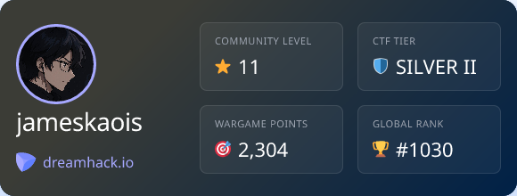

# Dreamhack Stats Badge

I built this little tool to generate a dynamic SVG badge of my Dreamhack stats (Level, CTF Tier, Wargame Points, etc.) so I could display it on my GitHub profile.

It runs on Vercel Edge Functions and uses next/og to style the badge. Since Dreamhack doesn't have a public API for these specific stats, this script fetches my public profile page and extracts the data directly from the HTML.

## How to use it

### 1. Set your User ID

You need to point this to your own profile.

1. Go to your Dreamhack profile page and check the URL.

- Example: https://dreamhack.io/users/12345/ -> 12345 is your ID.

2. Open `app/api/badge/route.jsx`.

3. Change the `userId` variable at the top of the function:

```javascript
export async function GET(req) {
  const userId = "YOUR_ID_HERE"; // <--- Put your ID here
  const targetUrl = `https://dreamhack.io/users/${userId}/`;

  // ...
}
```

### 2. Deploy

The easiest way to host this is on Vercel.

1. Push this code to a GitHub repository.
2. Go to Vercel and create a new project from that repo.
3. It should auto-detect it's a Next.js app. Just hit deploy.

### 3. Add to your Profile

Once it's deployed, you can use the link in your GitHub README.md or any HTML page.

Markdown:

```md

```

HTML:

```html

```

## Local Testing

If you want to tweak the design locally:

```bash
npm install
npm run dev
```

Then visit `http://localhost:3000/api/my-badge`.

## Example Badge


